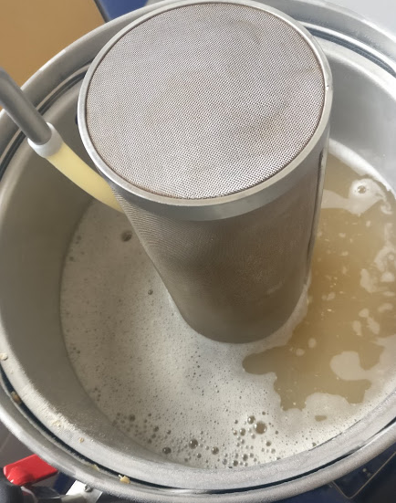
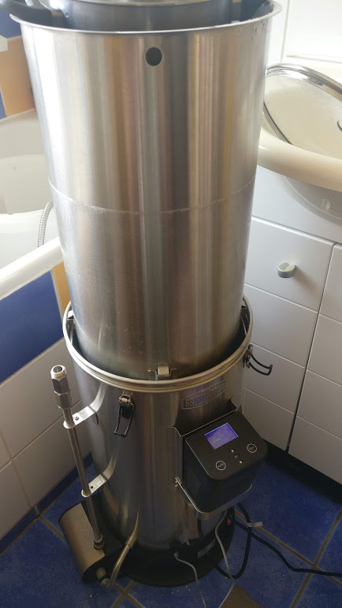
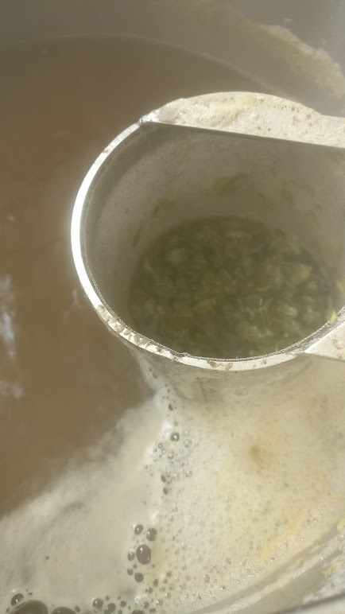
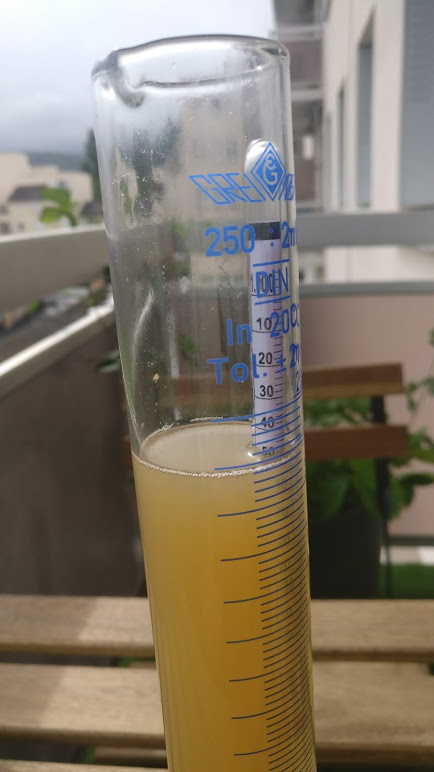
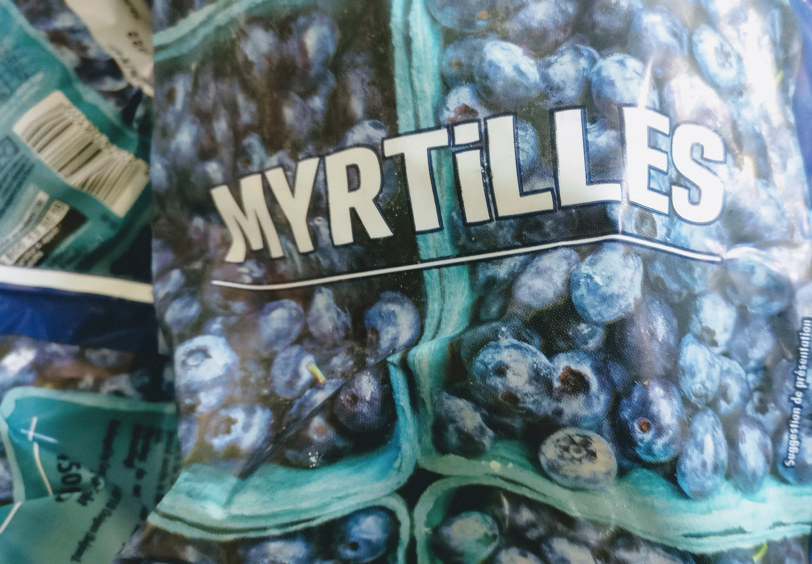
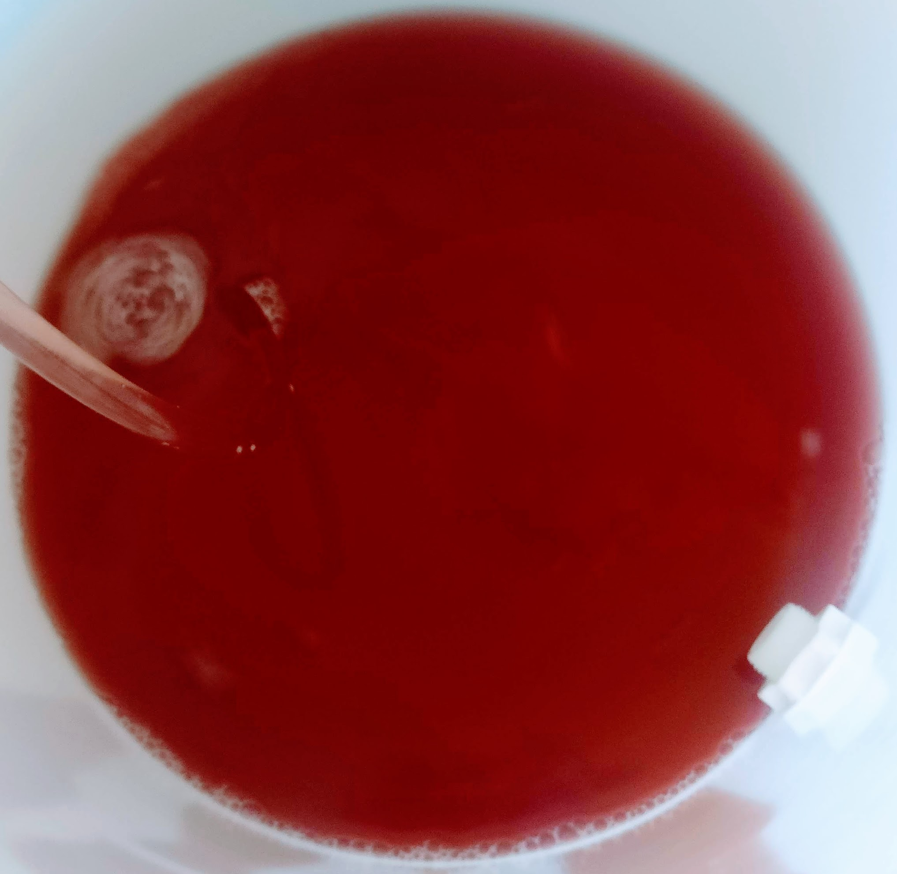

Le brassage est un de mes hobbies depuis quelques années. Je suis donc régulièrement amené à concevoir de nouveaux breuvages. Je vous propose de partager avec vous quelques une de mes recettes !

Pour cette première nous allons mijoter une blanche aux myrtilles sauvages :)

# Les ingrédients

Commençons par les ingrédients. Dans ce billet vous aurez la liste des ingrédients nécessaires pour produire environs 23 Litres.

Vous pouvez à tout moment retrouver cette recette sur [Beer Factory](https://mybeerfactory.fr/brewery/recipes/5eaf3255c00ca708f38d7c5f).

## Les grains

| Nom                  | quantité | lien                                                                                                      |
| -------------------- | --------- | --------------------------------------------------------------------------------------------------------- |
| Pale ale (ou pilsen) | 2,3 Kg.   | [Acheter](https://www.microbrasseur.com/Ingredients-pour-la-biere-Malt-en-grains-Malt-Chateau-Pilsen-mbf.) |
| Malt Munich          | 150 g.    | [Acheter](https://www.microbrasseur.com/Ingredients-pour-la-biere-Malt-en-grains-Malt-Munich-Light-mbf.)   |
| Malt de blé          | 2,25 Kg.  |                                                                                                           |
| Flocon d'avoine      | 500 g.    |                                                                                                           |

> Si vous souhaitez donner un peu plus de corps vous pouvez pousser la dose de flocon d'avoine jusqu'à 800 g. voir 1 kg.

## Les houblons

| Nom     | quantité | lien                                                                                                       |
| ------- | --------- | ---------------------------------------------------------------------------------------------------------- |
| Golding | 42 g.     | [Acheter](https://www.microbrasseur.com/Ingredients-pour-la-biere-Houblons-Houblon-East-Kent-Golding-mbf.) |

Pour ce qui est de l'utilisation de ces houblons il seront répartis de la manière suivante

| Nom     | Usage       | Temps   |
| ------- | ----------- | ------- |
| Golding | Amérisant   | 60 min. |
| Golding | Aromatiques | 20 min. |

## Levure

Côté levures j'ai fait le choix de la [US05](https://www.microbrasseur.com/Ingredients-pour-la-biere-Levures-Levure-seche-US05-mbf.) de chez fermentis. Elle est assez neutre et polyvalente.
Vous pouvez aussi opter pour la [WB06](https://www.microbrasseur.com/Ingredients-pour-la-biere-Levures-Levure-seche-WB06-mbf.) qui est bien adaptée aux bières blanches.

> Attention, si vous choisissez la WB06. Ce type de levure est tenace et peut contaminer vos brassins ultérieurs. Soyez très minutieux lors du néttoyage de votre fermenteur après utilisation de cette souche.

## Autres

| Nom                          | quantités |                                                                   |
| ---------------------------- | --------- | ----------------------------------------------------------------- |
| Myrtilles sauvages congelées | 2 kg.     | Pour la fermentation secondaire                                   |
| Irsh mosh                    | 5 g.      | Algue aidant à la coagulation permettant de clarifier votre bière |

# Au travail

## Préparation

Maintenant que vous avez fait vos emplettes il n'y à plus qu'à brasser !
Tout d'abord lancez la chauffe de votre eau d'empâtage pour atteindre 65 °C. De mon côté je brasse sur Grainfather j'ai besoin de faire chauffer 17,4 Litres d'eau.
Si vous utilisé un système similaire ce volume devrait être le même sinon vous pouvez calculer le volume nécessaire à votre équiment [grâce à des outils de calcul de volume](https://mybeerfactory.fr/brewery/volume-tool).
Cette température d'empâtage va nous permettre d'avoir une bière avec peu de corps et extraire un peu plus d'alcool. Cela nous permettra ainsi de mettre en avant la myrtille. Si vous souhaitez plus insister sur les malts n'hésitez pas à faire grimper le thermomètre de quelques degrés, à 68 °C par exemple.

## Concassage

Pendant le temps de chauffe à vos moulins, il y a du malt à concasser ! Si c'est votre premier brassin vous vous demanderez certainement comment régler votre moulin. Plus le concassage sera fin plus vous aurez un rendement élevé, cependant en contre-partie vous aurez un rinçage ou une filtration beaucoup plus longue et généralement une bière plus trouble. Un bon compromis et de régler votre équipement en vous basant sur l'épaisseur d'une carte bleu. Si vous avez un moulin à rouleaux faite en sorte de pouvoir passer une carte passe entre les deux rouleaux.

## L'empâtage

Votre eau est à température c'est le moment d'intégrer vos grains! C'est parti pour 60 min d'empâtage à 65 °C.
Cette phase permettra de transformer l'amidon présent dans le malt pour le transformer en sucre fermenticible (la saccharification).

> En régle générale 40 à 45 minutes est le temps nécessaire pour complèter cette étape. Par défaut il est préférable de pousser à 60 minutes pour en être certain mais vous pouvez réduire le temps de cette phase en faisant des contrôles à la [Teinture d'iode](https://www.microbrasseur.com/Materiel-Densimetres-et-autres-Teinture-iode-amidon-mbf.) qui vous permettra de vérifier l'avancement de votre empatâge.

Pendant cette phase, peu importe la technique que vous utilisez, veillez bien à ce que tout le grain soit humidifié et qu'il n'y ait pas de "grumeaux".

> Si vous brassez sur une système automatisé type Grainfather, utilisez un hop spider ou un petit filtre pour éviter que des résidus ne sorte de votre panier par l'axe central.

Une fois la saccharification terminée il est possible d'echaîner avec un palier de mash out à 75°C pendant 10 minutes. Nous verrons dans un futur billet les bénéfices de cette étape mais en deux mots elle permet de stabiliser votre moût en stoppant certaines réactions qui pourraient impacter votre breuvage. Cela s'avère particulièrment utile ppur prévenir des impacts néfaste d'un rinçage trop long.

## Le rinçage

C'est le moment du rinçage. Dans mon cas 14,7 Litres à 78 °C sont nécessaires. N'ayant pas l'équipement adapté pour chauffé mon eau je fait un rincage avec de l'eau du robinet la plus chaude possible (environ 50 °C) mélangé avec quelques litres d'eau que j'ai porté à ébullition. Ceci me permet de débuter mon sparge à 65 °C et de le finir vers 50 °C. Ce n'est pas idéal vis à vis des bonnes pratique communément appliqué cependant il y a de plus en plus d'articles qui tendent à démontrer que la température jou un rôle mineur lors du rinçage (surtout après un mash out à 75°C). Donc personnellement je ne me stress pas trop concernant ce point :)

## L'ébullition

Cette étape est essentielle afin stériliser son moût et d'extraire les huiles essentielles de houblons. Ceci est plus méconnu mais c'est aussi un des acteurs pouvant influé sur la limpidité de votre breuvage.

C'est donc parti pour 1 heure d'ébullition. N'oubliez pas d'ajouter vos houblons et votre clarifiant! Pour rappel dés que vous lancez votre chronomètre ajoutez les 28g d'amérisant, à 20 minutes de la fin les 14g d'aromatique et à 5 minutes les 5g. de clarifiant.

N'oubliez pas aussi d'immerger votre serpentin de refroidissement ou de faire circuler votre moût dans vos échangeurs à plaques ou autre contre-courant pendant 15 à 20 minutes pour bien les stériliser.

## Réhydratation des levures

Si vous utilisez une levure désidratée comme dans cette recette, à 15-20 min de la fin de votre ébullition il est intéressant de la réhydrater.
Cette étape est optionnelle est aurait pour effet de limiter le stress de vos levures. Pour ce faire prenez un peu de votre moût en ébullition et dilué le avec de l'eau froide pour tomber vers les 20°C. Ajoutez y vos levures et couvrez pour éviter les infections.

Pour ma part quand je pense à faire une réhydratation je la fait directement dans mon fermenteur préalablement nettoyé et désinfecté.

## Le refroidissement

Le but est de réduire la température de votre moût de 100°C à environ 20°C afin de ne pas tuer vos levures. Une fois votre moût à bonne température transférer dans votre fermenteur et ajoutez y les levures. N'hésitez pas à faire un peu d'éclaboussures afin d'oxygéner le moût ce qui permettra aux levures de bien se développer. Attention cependant après cette étape l'oxygène deviendra votre ennemis!

> 20-30 minutes avant de lancer votre transfert vous pouvez faire un whirlpool afin de clarifier votre futur brevage.

## Mesurer

Avant de fermer votre fermenteur n'oubliez pas de prendre une mesure de densité. Cette mesure vous permettra de calculer l'alcool de votre breuvage et de contrôler l'avancement de votre fermentation! Vous devriez avoir une densité initiale en 1,049 et 1,051.

# Tout vient à point à qui sait attendre

Première phase d'attente, la fermentation. Durant cette période les levure consomment les sucres fermenticible et produisent du CO2 et de l'alcool. Durant cette phase votre pire ennemis reste l'impatience, de mauvaises conditions d'hygiènes ou de température.
Sans être obliger de controler au degrés près il est nécessaire de placé votre fermenteur dans une pièce respectant la plage de tempèrature de vos levures. Attention tout de même, la fermentation dégage de la chaleur, il est donc important que votre environnement soit toujours entre 2 et 4 degrés sous la limite haute de la plage de fonctionnement de vos levures.

Cette étape peut-être frustante et génératrice d'angoisse car vous ne pouvez pas voir ce qui se passe dans votre fermenteur. Certain appareil connecté comme le Ispindel (ou [float](https://www.microbrasseur.com/Materiel-Densimetres-et-autres-Float---Densimetre-Wifi-mbf)) ou le Plaato permettent de suivre en live l'évolution de votre densité sur [Beer factory](https://mybeerfactory.fr/brewery).

> Attention ces différents outils ne sont pas précis. Il faut vraiment les utiliser pour ce qu'ils sont, de bons moyens de monitorer l'activité de sa fermentation mais pas des moyens de mesures précis.

## Et les myrtilles

Dans notre recette nous allons ajouter des myrtilles en fermentation secondaire, après la tumulteuse (quand il y a plein de glouglou) 3 à 4 jours après le démarrage de votre fermentation.

L'ajout de fruits pendant la fermentation n'est pas très complex mais doit se faire avec précaution. En effet, la peau des fruits est naturellement recouvert de bactéries qui ne sont pas les bienvenues dans le cadre de notre recette.

L'ajout de fruit peux se faire de trois manières:

- Fruits frais: Faites chauffer vos fruits au bain-marie entre 80 et 90°C pendant une dizaine de minute pour les désinfecter. Laissez-les refroidir en laissant couvert ou en fesait un "bain-marie froid". Ajoutez ensuite les fruits dans une chausette à houblon désinfecté et le jus directement dans le fermenteur!

- Fruits congelés: Normalement pasterisés pendant le processus de production ils peuvent être ajouter directement dans le fermenteur dans une chaussette à houblon pasteurisé. Vous pouvez préalablement les décongeler pour ne pas trop impacter la température dans votre fermenteur.

- Purée de fruits: Si elle est pastériser vous pouvez l'intégrer directement dans le fermenteur.

# Conclusion

Quelques jours d'attentes supplémentaires et une densité stable, ça y est votre breuvage est prêt à être mis en bouteille!

Voilà vous pouvez maintenant déguster une bonne blanche aux myrtilles!

N'hésitez pas à me faire part de vos remarques, idées d'amélioration ou simplement à partager vos créations en commentaire ou sur le [groupe facebook](https://www.facebook.com/beerFactoryApp). Cet article étant le premier je suis entrée dans les détails mais au fur et à mesure j'ai prévu de rester plus succinct qu'en pensez vous ?
