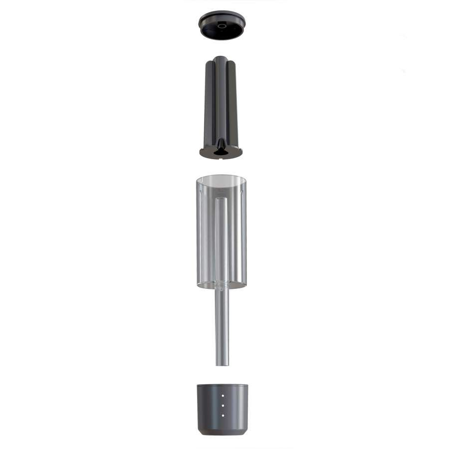

Aujourd'hui je vous propose un premier article de test. Nous parlerons du Airlock de plaato.

> Cet article n'est pas sponsorisé et n'engage que moi. Il est le reflet d'un usage sur un peu plus d'un an sur une dizaine de brassin.

# Qu'est ce que c'est ?

Le plaato est un barboteur connecté. Sa promesse? Fournir un moyen non invasif de surveiller la progression de vos fermentations.

Le principe est assez simple. L'appareil est composé de trois parties.

- Un socle capable de communiquer en wifi et muni d'un capteur infra-rouge. Ce dernier va compter les bulles s'échappant de votre fermenteur et de mesurer la température.
- Un reservoir transparent contenant l'eau garantissant l'étanchéité
- Un pièce centrale noire "dirigeant" les bulles pour qu'elle passe devant le capteur infra-rouge. 

> Attention, le socle connecté n'est pas étanche !

# L'application

Les résultat sont ensuite exploitable via l'application officiale. Cette dernière est plutôt bien faite et simple à prendre en main. Elle est disponible sur Android et iOS.

Très bon point supplémentaire elle permet la redirection vers d'autres systèmes. C'est grâce à ceci que Beer factory vous permet d'exploiter ces résultats.

# Des limites technologiques

Comme je le disais précédemment l'application permet de ne pas être trop enfermé et d'exporter ces données vers d'autres systèmes.

Cependant il présente des limites qu'il est nécessaire de connaître.

## Cloud only
Il nécessaire d'avoir un accés internet et de passé par le cloud de plaato. Sur ce point il ne sont pas les seuls, beaucoup d'autres appareils connectés ont le même défaut. Le problème avec cette approche est que si demain l'entreprise  ferme le service votre produits ne pourra plus servir.

## Un connectivité désuéte 
Il n'est pas compatible Wifi 5Ghz. A l'heure ou l'on commence à parler de Wifi 6 il est dommage de ne pas proposé une connectivité un peu moins désuéte. Cela provoque souvent certain problème de connectivité.

## Résiliance limitée
Il ne semble pas "mémorisé" de données. Ce qui fait que si vous perdez la connexion vous aurez un trou dans vos données.

## Pas de batterie
Autre point qui est pour moi secondaire mais dommage, il ndoit être branché en permanence, il ne possède pas de batterie. Cependant il utilise une connection micro USB. Bien qu'aujourd'hui désuet il n'en reste pas moins plutôt répandu et ouvert (contrairement à la connectivitée choisi pour le Plaato Keg).

# De qualité douteuse

Plastique qui se déforme, forum et page facebook remplis de plaintes à propos d'appareil défectueux, etc. Globalement lorsque l'on tiens l'objet dans les mains on sent que ce n'est pas très qualitatif.

Le packaging et la communication son soigné mais pour ce qui est du produit par lui même on sent

Heureusement que le service après vente est efficace et ne cherche pas la petite bête sinon cela pourrait être une catastrophe.

# Principe incertain

Enfin le principe par lui même est incertain. Tout brasseur agéri le sais, l'activité dans le barboteur ne veux rien dire. Entre les problèmes d'étanchéité et de dissolution du CO2 dans votre moût seul la vrai messure de densité est fiable.

Dans mon cas jusqu'ici il s'avère cependant assez proche de la vérité.

# Conclusion

Vous l'aurez compris je ne vous recommande pas forcément ce produit.

Le principe est intéresant mais n'est pas suffisamment qualitatif pour y mettre le prix demandé. Pour le moment mon exemplaire est toujours fonctionnel et me donne encore satisfaction mais pour combien de brassin encore ?

Leur second produit, le platoo Keg semble souffrir des même type de défaut raison pour laquelle je n'ai pas craqué (et que l'intégraton n'est pas disponible sur [My Beer Factory](https://mybeerfactory.fr))
Espérons que la jeune entreprise norvégienne nous propose une seconde version plus qualitative.

N'hésitez pas à me faire part de vos remarques, idées d'amélioration ou simplement à partager vos créations en commentaire ou sur le [groupe facebook](https://www.facebook.com/beerFactoryApp). Cet article étant le premier je suis entrée dans les détails mais au fur et à mesure j'ai prévu de rester plus succinct qu'en pensez vous ?
