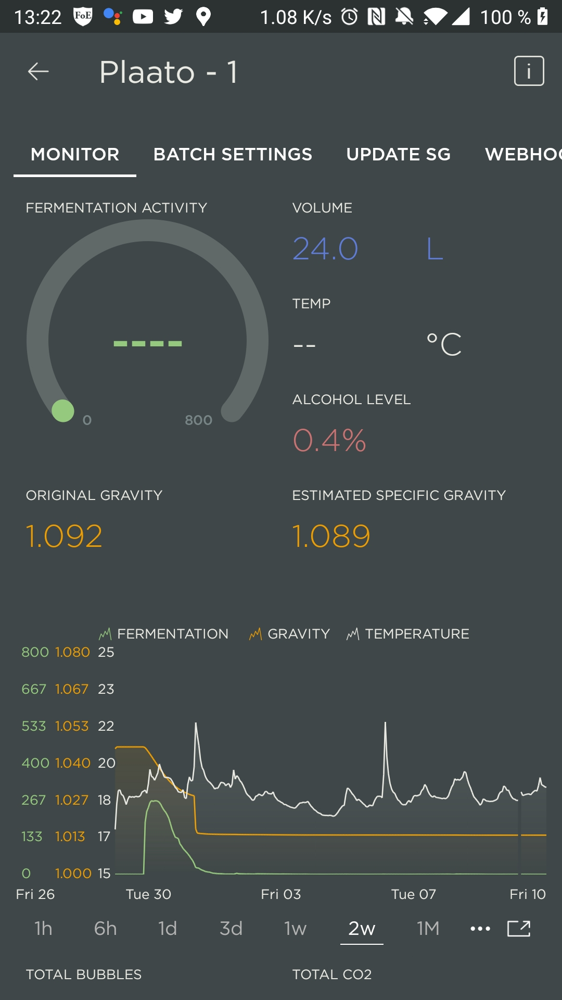

Aujourd'hui je vous propose un premier article de test. Nous parlerons du Airlock de Plaato.

> Cet article n'est pas sponsorisé et n'engage que moi. Il est le reflet d'un usage sur un peu plus d'un an sur une dizaine de brassins.

# Qu'est ce que c'est ?

Le plaato est un barboteur connecté. Sa promesse? Fournir un moyen non invasif de surveiller la progression de vos fermentations.

Le principe est assez simple. L'appareil est composé de trois parties.

- Un socle capable de communiquer en wifi et muni d'un capteur infra-rouge. Ce dernier va compter les bulles s'échappant de votre fermenteur et de mesurer la température.
- Un réservoir transparent contenant l'eau garantissant l'étanchéité
- Une pièce centrale noire "dirigeant" les bulles pour qu'elles passent devant le capteur infra-rouge. 

> Attention, le socle connecté n'est pas étanche !

# L'application

Les résultats sont ensuite exploitables via l'application officielle. Cette dernière est plutôt bien faite et simple à prendre en main. Elle est disponible sur Android et iOS.

Très bon point supplémentaire elle permet la redirection vers d'autres systèmes. C'est grâce à ceci que Beer factory vous permet d'exploiter ces résultats. 

> Ce point peu sembler secondaire mais il ne l'est pas. L'ouverture est un point très important lors du choix d'un objet connecté. En effet si vous le négligez vous risquez de vous retrouver prisonnié. Ici ce n'est pas le cas c'est un très bon point ! 

# Des limites technologiques
Comme je le disais précédemment l'application est plutôt efficace et la plateforme reste plutôt ouverte.
Cependant, il y a certaines limites qu'il est nécessaire de connaître.

## Cloud only
Il est nécessaire d'avoir un accès internet et de passer par le service cloud de plaato. Sur ce point il ne sont pas les seuls, beaucoup d'autres appareils connectés ont le même défaut. Le problème de cette approche est que si demain l'entreprise ferme le service, votre produit ne pourra plus servir.
De plus s'il décide de se refermer et d'arrèter les services d'accés aux données ils peuvent le faire sans problème.

## Un connectivité désuéte 
Il n'est pas compatible Wifi 5Ghz. A l'heure ou l'on commence à parler de Wifi 6 il est dommage de ne pas proposer une connectivité un peu moins désuéte. Cela provoque souvent certain problème de connectivité.

## Résiliance limitée
Il ne semble pas "mémoriser" de données. Ce qui fait que si vous perdez la connexion vous aurez un trou dans vos données.

## Pas de batterie
Autre point qui est pour moi secondaire mais dommage, il doit être branché en permanence, il ne possède pas de batterie. Cependant il utilise une connection micro USB. Bien qu'aujourd'hui désuet il n'en reste pas moins plutôt répandu et ouvert (contrairement à la connectivitée choisi pour le Plaato Keg).

# De qualité douteuse

Plastique qui se déforme, forum et page facebook remplis de plaintes à propos d'appareil défectueux, etc. Globalement lorsque l'on tiens l'objet dans les mains on sent que ce n'est pas très qualitatif.

Le packaging et la communication sont soignés mais pour ce qui est du produit par lui même ce n'est pas le top du top.

Heureusement que le service après vente est efficace et ne cherche pas la petite bête sinon cela pourrait être problèmatique.

# Principe incertain

Enfin le principe par lui même est incertain. Tout brasseur agéri le sais, l'activité dans le barboteur ne veux rien dire. Entre les problèmes d'étanchéité et de dissolution du CO2 dans votre moût seul la vrai messure de densité est fiable.

Dans mon cas jusqu'ici il s'avère cependant assez proche de la vérité.

# Pourquoi quand même l'acheter ?
 Après la première relecture de ce billet je me suis rendu compte qu'il y avait beaucoup de points négatifs. Je me suis donc demandé ferrais-je à nouveau ce choix ?  
 Je pense que oui même si le rapport qualité prix n'est pas le meilleur.

 Pourquoi? car c'est le bébé d'une petite entreprise innovante. Qu'il est simple d'utilisation, suffisamment ouvert (même si j'aurais aimé plus) et qu'à ce jour les écarts avec les mesures au densimètre ne sont pas si grande dans mon cas.
 Je pense que l'usage d'un fermenteur de bonne qualité qui assure une bonne étanchéité ([SS BREWTECH - 7 GALLONS BREW BUCKET ](https://www.saveur-biere.com/fr/outils-de-mesure/33649-ss-brewtech-7-gallons-brew-bucket-brewmaster-edition-celcius-cuve-de-fermentation-inox-26-5-l-edition-celsius.html#ae247))

 Je pense serieusement qu'avec un peu plus de maturité et de temps c'est une entreprise qui pourrait nous suprendre et créer de très bon produits.  

# Conclusion

Vous l'aurez compris mon avis sur ce produit est donc mitigé.

Le principe est intéresant mais n'est pas suffisamment qualitatif pour y mettre le prix demandé. Pour le moment mon exemplaire est toujours fonctionnel et me donne encore satisfaction mais pour combien de brassin encore ?

Leur second produit, le platoo Keg semble souffrir des même type de défaut raison pour laquelle je n'ai pas craqué (et que l'intégraton n'est pas disponible sur [My Beer Factory](https://mybeerfactory.fr))
Espérons que la jeune entreprise norvégienne nous propose une seconde version plus qualitative.

Vous possédez l'Airlock ? Qu'en pensez vous ? N'hésitez pas à me faire part de vos remarques, idées d'améliorations ou simplement à partager vos avis en commentaire ou sur le [groupe facebook](https://www.facebook.com/beerFactoryApp).

A bientôt!
